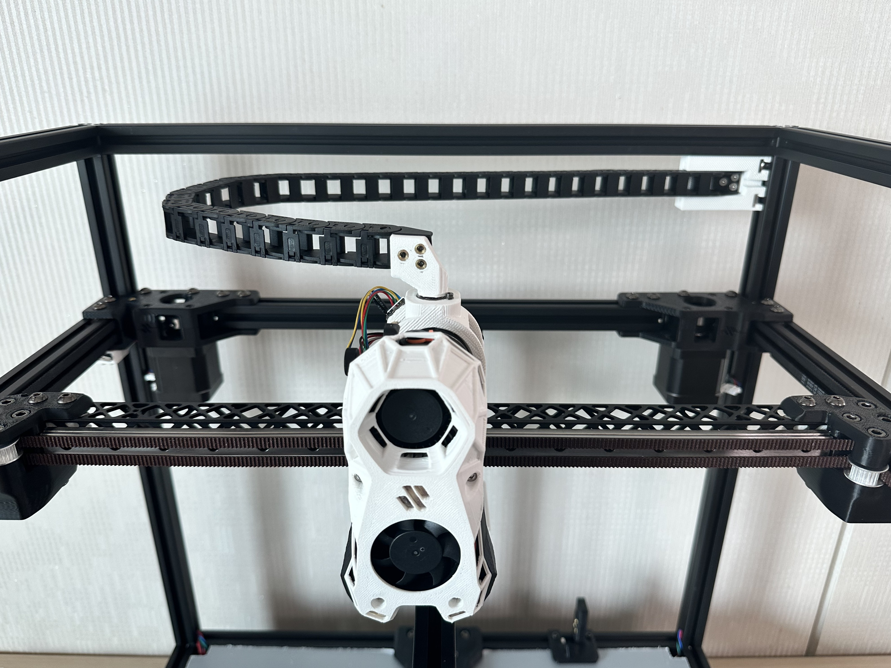
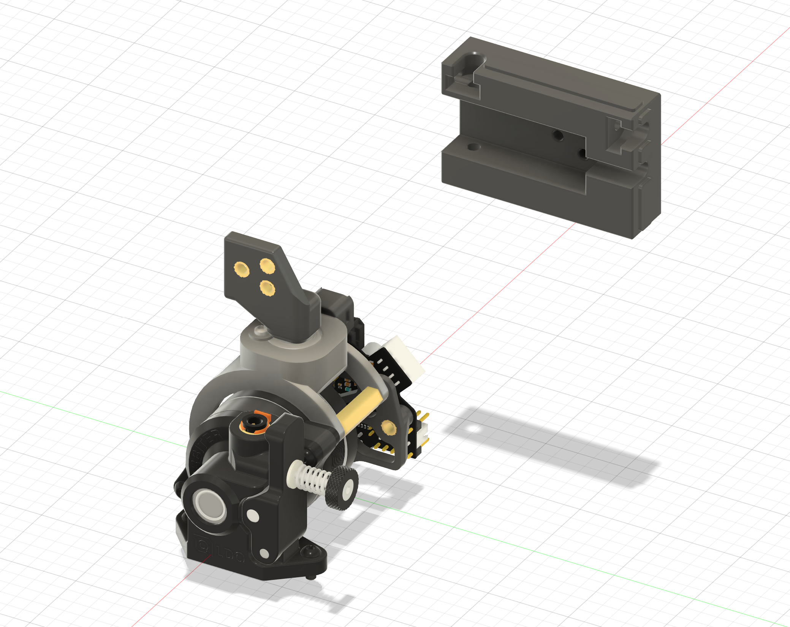

# Voron Trident Horizental Drag Chain for Oribter/Stealthburner

# BOM
| Components | Qty |
|-|-|
| F695ZZ | 1 |
| Heatinsert M3 | 5 |
| M5x12 BHCS | 1 |
| M5x10 BHCS | 1 |
| M5 nut | 1 |
| M5 2020 Drop in Tnut | 1 |
| M5 Washer | 1 |
| M3x20 SHCS | 2 |
| M3x8 SHCS |4 |
| M3x6 FHCS | 6 |
| M3 nut | 3 |
| M2x10 Selftapping Screw | 1 |
| M2 Washer | 1 |

# Instructions
## Heatinsert & Nuts Installation
||||
|-|-|-|  
## Orbiter Mount Stack

Note: Secure the F695ZZ bearing using an M2 self-tapping screw and an M2 washer.